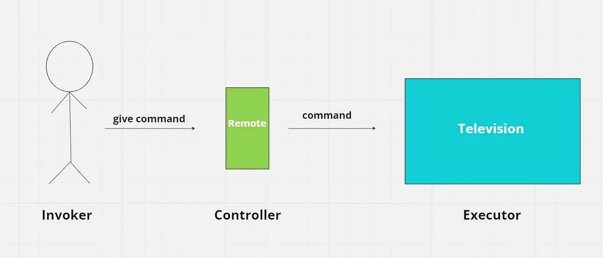

Behavioral design patterns in Java **focus on how objects interact and communicate with each other**. These patterns aim to improve the flexibility and maintainability of code by encapsulating behaviors and delegating responsibilities. Here are some of the key behavioral design patterns:
**<p>Common Behavioral Patterns:**<p>
***Chain of Responsibility:***<p>
Allows a request to be passed along a chain of handlers until one of them handles it.
***<p>Command:***<p>
Encapsulates a request as an object, allowing for parameterization and queuing of requests.
***<p>Interpreter:***<p>
Defines a grammar for a language and provides an interpreter to evaluate expressions in that language.
***<p>Iterator:***<p>
Provides a way to access the elements of a collection sequentially without exposing its underlying structure.
***<p>Mediator:***<p>
Reduces dependencies between objects by centralizing communication logic in a mediator object.
***<p>Memento:***<p>
Allows an object to save and restore its previous state without revealing its internal structure.
***<p>Observer:***<p>
Defines a one-to-many dependency between objects, where changes in one object automatically notify its dependents.
***<p>State:***<p>
Allows an object to alter its behavior when its internal state changes.
***<p>Strategy:***<p>
Enables selecting an algorithm at runtime by encapsulating different algorithms in separate classes.
***<p>Template Method:***<p>
Defines the skeleton of an algorithm in a base class, allowing subclasses to implement specific steps.
***<p>Visitor:***<p>
Separates an algorithm from the object structure on which it operates, allowing for adding new operations without modifying the object classes.

**<p>Key Characteristics:<p>**
***<p>Focus on Object Interaction:<p>***
These patterns primarily deal with how objects communicate and collaborate.
***<p>Loose Coupling:<p>***
They promote loose coupling between objects by delegating responsibilities and interactions.
***<p>Flexibility and Maintainability:<p>***
Behavioral patterns enhance code flexibility and make it easier to maintain and extend. 

***
These patterns are widely used in Java and other object-oriented programming languages. Understanding them can lead to more robust and adaptable software designs.
***

---
### Chain Of Responsibility Method Design Pattern

The Chain of Responsibility design pattern ***allows an object to pass a request along a chain of handlers***. Each handler in the chain decides either to process the request or to pass it along the chain to the next handler. 

**Below is when to use this method:-**

- Use them when your objects need to communicate in complicated ways.
- Choose them when you want to easily change how things behave while the program is running.

**Characteristics of the Chain of Responsibility Design Pattern**<p>
Below are the main characteristics of chain of responsibility design pattern:

- **Loose Coupling:**<p> This means the sender of a request doesn't need to know which specific object will handle it. Similarly, the handler doesn’t need to understand how the requests are sent. This keeps the components separate and flexible.
- **Dynamic Chain:**<p> While the program is running, changing the chain is simple. This makes your code incredibly flexible because you may add or delete handlers without changing the main body of the code.
- **Single Responsibility Principle:**<p> Each handler in the chain has one job: either to handle the request or to pass it to the next handler. This keeps the code organized and focused, making it easier to manage.
- **Sequential Order:**<p> Requests move through the chain one at a time. Each handler gets a chance to process the request in a specific order, ensuring consistency.
- **Fallback Mechanism:**<p> If a request isn’t handled by any of the handlers, the chain can include a fallback option. This means there's a default way to deal with requests that don't fit anywhere else.

**Components of the Chain of Responsibility Design Pattern**
The Chain of Responsibility Pattern consists of the following key components:

- **Handler Interface or Abstract Class:**<p> This is the base class that defines the interface for handling requests and, in many cases, for chaining to the next handler in the sequence.
- **Concrete Handlers:**<p> These are the classes that implement how the requests are going to be handled. They can handle the request or pass it to the next handler in the chain if it is unable to handle that request.
- **Client:**<p> The request is sent by the client, who then forwards it to the chain’s first handler. Which handler will finally handle the request is unknown to the client.

***Pros of the Chain of Responsibility Design Pattern:***<p>
Below are the pros of chain of responsibility design pattern:

- The pattern makes enables sending a request to a series of possible recipients without having to worry about which object will handle it in the end. This lessens the reliance between items.
- New handlers can be easily added or existing ones can be modified without affecting the client code. This promotes flexibility and extensibility within the system.
- The sequence and order of handling requests can be changed dynamically during runtime, which allows adjustment of the processing logic as per the requirements.
- It simplifies the interaction between the sender and receiver objects, as the sender does not need to know about the processing logic.

***Cons of the Chain of Responsibility Design Pattern:***<p>
Below are the cons of chain of responsibility design pattern:

- The chain should be implemented correctly otherwise there is a chance that some requests might not get handled at all, which leads to unexpected behavior in the application.
- The request will go through several handlers in the chain if it is lengthy and complicated, which could cause performance overhead. The processing logic of each handler has an effect on the system’s overall performance.
- The fact that the chain has several handlers can make debugging more difficult. Tracking the progression of a request and determining which handler is in charge of handling it can be difficult.
- It may become more difficult to manage and maintain the chain of responsibility if the chain is dynamically modified at runtime.

***Applications of Chain of Responsibility Design Pattern***<p>
Below are the applications of chain of responsibility design pattern:

- In graphical user interfaces (GUIs), events like mouse clicks or key presses can be handled by a chain of listeners. Each listener checks if it can handle the event, passing it along the chain if it can't. This way, multiple components can respond to the same event without being tightly linked.
- In logging systems, you might have different levels of loggers (like INFO, WARN, ERROR). Each logger can handle specific log messages. If one logger can’t process a message (for example, if it's below its level), it passes it to the next logger in the chain.
- In security systems, access requests can be processed by a series of handlers that check permissions. For instance, one handler might check user roles, while another checks specific permissions. If one handler denies access, it can pass the request to the next handler for further evaluation.

```declarative
//Handler Interface
//Defines the interface for handling requests. Includes methods for handling requests (handleRequest()) and setting the next handler in the chain (setNextHandler()).
public interface SupportHandler {
    void handleRequest(Request request);
    void setNextHandler(SupportHandler nextHandler);
}
```

---

**Template Design Pattern**

The Template Design Pattern is a behavioral design pattern **that defines the skeleton of an algorithm in a superclass** but allows subclasses to override specific steps of the algorithm without changing its overall structure.

***Key Components***
- ***Abstract Class (Template):***<p>
  Defines the algorithm's skeleton, which includes abstract methods for steps that can vary and concrete methods for invariant steps.

- ***Concrete Classes (Subclasses):***<p>
  Implement the abstract methods defined in the abstract class, providing specific implementations for the varying steps of the algorithm.

***How it Works:***
- The superclass defines the overall process (algorithm) with a template method.
- The template method calls other methods, some of which are abstract and must be implemented by subclasses.
- Subclasses provide specific implementations for the abstract methods, customizing the algorithm's behavior.

---
    // Abstract class defining the template method
    abstract class Task {
      // Template method
      public final void execute() {
        step1();
        step2();
        step3();
      }

      // Abstract methods to be implemented by subclasses
      abstract void step1();
      abstract void step2();

      // Concrete method common to all subclasses
      void step3() {
          System.out.println("Step 3: Common step");
      }
    }

    // Concrete subclass implementing specific step1 and step2
    class TaskA extends Task {
      @Override
      void step1() {
        System.out.println("Task A: Step 1");
      }

      @Override
      void step2() {
          System.outagg.println("Task A: Step 2");
      }
    }

    // Concrete subclass implementing specific step1 and step2
    class TaskB extends Task {
      @Override
      void step1() {
        System.out.println("Task B: Step 1");
      }

      @Override
      void step2() {
          System.out.println("Task B: Step 2");
      }
    }

    // Main method
    public class Main {
      public static void main(String[] args) {
        Task taskA = new TaskA();
        taskA.execute();
    
            Task taskB = new TaskB();
            taskB.execute();
        }
    }

---

***Benefits:***
- ***Code Reusability:***<p>
Common parts of the algorithm are implemented in the superclass, reducing code duplication.
- ***Flexibility:***<p>
Subclasses can customize certain steps of the algorithm without altering the overall structure.
- ***Maintainability:***<p>
Changes to common steps can be made in one place, simplifying code maintenance.

***Use Cases:***<p>
- ***Frameworks:***<p> Template Method is often used in frameworks to allow users to extend functionality by implementing specific steps.
- ***Workflow processes:***<p> Defining a workflow with common steps and allowing subclasses to customize certain tasks.
- ***Algorithm variations:***<p> Implementing different variations of an algorithm while maintaining the overall structure.

```
The Template Method Pattern is a useful tool for creating extensible and maintainable code by separating the algorithm's structure from its specific implementations.
```


---

### Command Pattern

Command Pattern is one of the Behavioral Design Pattern. It is used to implement loose coupling in a request-response model.

**The Command design pattern is a behavioral design pattern that aims to encapsulate a request as an object, thus allowing clients to parameterize and queue operations, as well as support undoable operations.**

It decouples the sender of a request from the receiver, providing a way to issue commands without knowing the specific operation that will be performed or the receiver of the request.

For example suppose you have a remote controller through which you can turn on / off the tv , change volume and change channel . <u>**So you are invoker of command , the remote controller is controller of command and tv is executer of command**</u> . So from invocation of command to its execution the process in between these two is completely hidden from you . So here command design pattern comes into picture it decouples the sender of request from the reciever and control the execution of commands .




**Components of Command Design Pattern**<p>
- **Command:**<p> This is the core interface that declares the execution method. It typically includes a single method, such as execute(), which encapsulates the action to be performed.
- **ConcreteCommand:**<p> This class implements the Command interface and represents a specific command. It contains a reference to the receiver (the object that will perform the action) and implements the execute() method by invoking the corresponding operation on the receiver.
- **Receiver:**<p> The Receiver class defines the object that will perform the actual action requested by the command. It contains the necessary logic and functionality to carry out the operation. This can also be defined as Executer .
- **Controller:**<p> This class is responsible for controlling the commands. It receives the command object, usually through a setter method, and triggers the execution of the command when required.
- **Invoker:**<p>The Invoker creates the command objects, sets their receivers (if necessary), and assigns them to the controller. It is responsible for initiating requests .

**REF:** <p>
- [Command Design Pattern _ DigitalOcean.html](../../../../../../assets/html/Command%20Design%20Pattern%20_%20DigitalOcean.html)  <p>
- [Command Design Pattern in Java. This blog is complete tutorial of… _ by Akshat Sharma _ Medium.html](../../../../../../assets/html/Command%20Design%20Pattern%20in%20Java.%20This%20blog%20is%20complete%20tutorial%20of%E2%80%A6%20_%20by%20Akshat%20Sharma%20_%20Medium.html)


---

### Mediator Pattern

The Mediator design pattern is a behavioral pattern that centralizes communication between objects, reducing direct dependencies and promoting loose coupling. Instead of objects interacting directly, they communicate through a mediator object, which manages and coordinates their interactions.

**Key Components:**<p>
- **Mediator:**<p>
An interface defining the communication contract between objects.
- **Concrete Mediator:**<p>
Implements the mediator interface, managing communication between objects and maintaining references to them.
- **Colleague:**<p>
Objects that need to communicate with each other, aware of the mediator and using it for communication.
- **Concrete Colleague:**<p>
Specific implementations of colleagues that participate in communication through the mediator.

**How it Works:**<p>
Colleagues send requests to the mediator rather than directly to other colleagues.
The mediator receives the request and directs it to the appropriate colleague(s).
Colleagues are unaware of each other, only knowing the mediator.

**Benefits:**<p>
- **Reduced Coupling:**<p> Objects don't need to know about each other, promoting modularity.
- **Centralized Control:**<p> Communication logic is managed in one place, simplifying maintenance.
- **Flexibility:**<p> Easier to change interactions between objects without affecting other parts of the system.
- **Reusability:**<p> Components can be reused in different contexts by providing them with a new mediator.

**Use Cases:**<p>
- GUI components interacting with each other.
- Complex systems with many interacting objects.
- When communication logic between objects becomes complex.


```declarative
// Mediator Interface 
interface Mediator {
    void sendMessage(String message, Colleague colleague);
}

// Concrete Mediator
class ConcreteMediator implements Mediator {
    private Colleague colleague1;
    private Colleague colleague2;

    public void setColleague1(Colleague colleague1) {
        this.colleague1 = colleague1;
    }

    public void setColleague2(Colleague colleague2) {
        this.colleague2 = colleague2;
    }

    @Override
    public void sendMessage(String message, Colleague colleague) {
        if (colleague == colleague1) {
            colleague2.receiveMessage(message);
        } else if (colleague == colleague2) {
            colleague1.receiveMessage(message);
        }
    }
}

// Colleague Interface
interface Colleague {
    void sendMessage(String message);
    void receiveMessage(String message);
}

// Concrete Colleague
class ConcreteColleague implements Colleague {
    private Mediator mediator;
    private String name;

    public ConcreteColleague(Mediator mediator, String name) {
        this.mediator = mediator;
        this.name = name;
    }

    @Override
    public void sendMessage(String message) {
        System.out.println(name + " sends: " + message);
        mediator.sendMessage(message, this);
    }

    @Override
    public void receiveMessage(String message) {
        System.out.println(name + " receives: " + message);
    }
}

// Usage
public class Main {
    public static void main(String[] args) {
        ConcreteMediator mediator = new ConcreteMediator();

        ConcreteColleague colleague1 = new ConcreteColleague(mediator, "Colleague 1");
        ConcreteColleague colleague2 = new ConcreteColleague(mediator, "Colleague 2");

        mediator.setColleague1(colleague1);
        mediator.setColleague2(colleague2);

        colleague1.sendMessage("Hello from Colleague 1");
        colleague2.sendMessage("Hi from Colleague 2");
    }
}
```

> This example demonstrates how the ConcreteMediator manages communication between ConcreteColleague objects, reducing direct dependencies.<p>
> **NOTE:**  it is evident that Mediator knows everything about all Colleagues classes but Colleagues classes only knows about mediator to which it is sending messages but not about other participating colleagues classes.


**REF:**<p>
- [Mediator Design Pattern in Java _ DigitalOcean.html](../../../../../../assets/html/Mediator%20Design%20Pattern%20in%20Java%20_%20DigitalOcean.html)


---

### Observer Pattern

The Observer design pattern is a behavioral design pattern that defines a one-to-many dependency between objects. In this pattern, a subject object maintains a list of its dependents, called observers, and notifies them automatically of any state changes, usually by calling one of their methods.

Think of it like a newspaper subscription. You (the observer) subscribe to a newspaper (the subject). When a new edition is published (the subject's state changes), the newspaper delivers it to all its subscribers (notifies the observers).

**Key Components:**<p>

- **Subject (Observable):**<p>
An interface or abstract class that defines the methods for attaching, detaching, and notifying observers.
The concrete subject maintains a list of observer objects.
When its state changes, it notifies all registered observers.

- **Observer:**<p>
An interface or abstract class that defines the update() method. This method is called by the subject to notify the observer about the state change.
Concrete Subject:

- **A concrete class that extends the Subject.**<p>
It holds the actual state and notifies observers when this state changes.
Concrete Observer:

- **A concrete class that implements the Observer interface.**<p>
Each observer registers with a subject to receive updates.
They implement the update() method to react to the notifications from the subject.

**How it Works:**<p>

1. Observers register themselves with the subject.
2. When the subject's state changes, it iterates through its list of observers and calls the update() method on each one.
3. Each observer then reacts to the notification in its own way.

**Benefits of the Observer Pattern:**<p>

- **Loose Coupling:**<p> The subject and observers are loosely coupled. The subject doesn't need to know the specifics of each observer; it only needs to know that they implement the Observer interface. This allows you to add new observers without modifying the subject.
- **Publish/Subscribe:**<p> It supports a "publish-subscribe" model, where the subject publishes events, and observers subscribe to receive notifications about those events.
- **Dynamic Relationships:**<p> You can add and remove observers at runtime.

**Example in Java:**

Java has built-in support for the Observer pattern through the java.util.Observable class and the java.util.Observer interface. However, these are not always preferred for new development due to certain limitations. It's more common to implement the pattern directly using interfaces.

```
import java.util.ArrayList;
import java.util.List;

// Subject Interface
interface Subject {
void registerObserver(Observer o);
void unregisterObserver(Observer o);
void notifyObservers();
}

// Concrete Subject
class ConcreteSubject implements Subject {
private List<Observer> observers = new ArrayList<>();
private String state;

    public String getState() {
        return state;
    }

    public void setState(String state) {
        this.state = state;
        notifyObservers();
    }

    @Override
    public void registerObserver(Observer o) {
        observers.add(o);
    }

    @Override
    public void unregisterObserver(Observer o) {
        observers.remove(o);
    }

    @Override
    public void notifyObservers() {
        for (Observer observer : observers) {
            observer.update(state);
        }
    }
}

// Observer Interface
interface Observer {
void update(String state);
}

// Concrete Observer 1
class ConcreteObserver1 implements Observer {
private String observerName;

    public ConcreteObserver1(String name) {
        this.observerName = name;
    }

    @Override
    public void update(String state) {
        System.out.println(observerName + " received update: State is now " + state);
    }
}

// Concrete Observer 2
class ConcreteObserver2 implements Observer {
private String observerName;

    public ConcreteObserver2(String name) {
        this.observerName = name;
    }

    @Override
    public void update(String state) {
        System.out.println(observerName + " reacted to state change: " + state.toUpperCase());
    }
}

public class ObserverDemo {
public static void main(String[] args) {
ConcreteSubject subject = new ConcreteSubject();

        ConcreteObserver1 observer1 = new ConcreteObserver1("Observer A");
        ConcreteObserver2 observer2 = new ConcreteObserver2("Observer B");

        subject.registerObserver(observer1);
        subject.registerObserver(observer2);

        subject.setState("New State 1");
        System.out.println("---");
        subject.setState("Another Change");

        subject.unregisterObserver(observer1);
        System.out.println("---");
        subject.setState("Final State");
    }
}
Output of the example:

Observer A received update: State is now New State 1
Observer B reacted to state change: NEW STATE 1
---
Observer A received update: State is now Another Change
Observer B reacted to state change: ANOTHER CHANGE
---
Observer B reacted to state change: FINAL STATE
In this example, ConcreteSubject is the subject, and ConcreteObserver1 and ConcreteObserver2 are the observers. When the state of the ConcreteSubject changes, both registered observers are notified and react accordingly.

```

