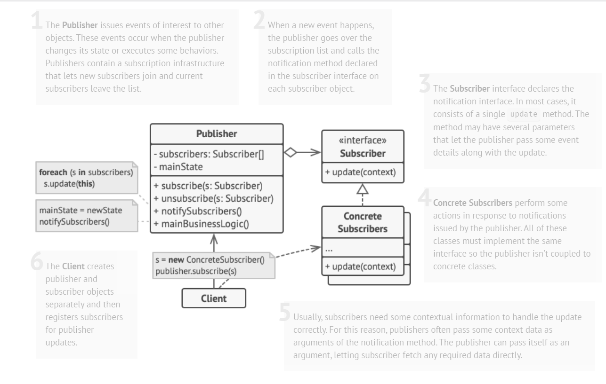
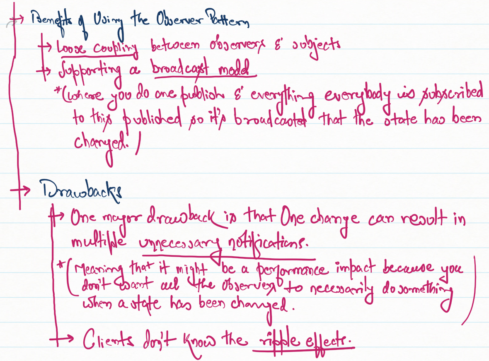

Intro

* Observer is a behavioral Design Pattern that lets you define a subscription mechanism to notify multiple objects about any events that happen to the Object they are observing
* Analogy can be the newspaper subscription, which is pretty good example of Observer Pattern, where we call the PUBLISHER the <i>SUBJECT</i> & the SUBSCRIBERS the <i>OBSERVERS</i>
* The Observer Pattern defines a one-to-many dependency between a set of Objects so that when one Object changes state, all of its dependents are notified and updated automatically.

Structure/Call Diagram for the Observer Pattern

Benefits & Drawbacks

